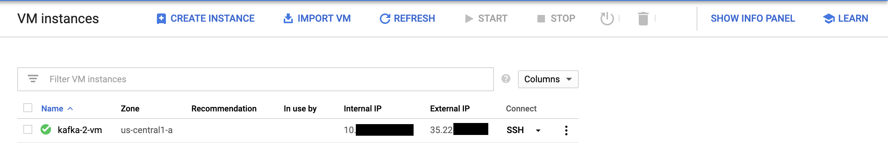
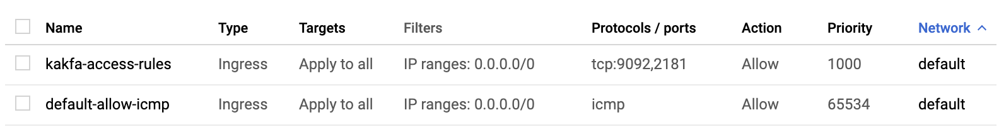
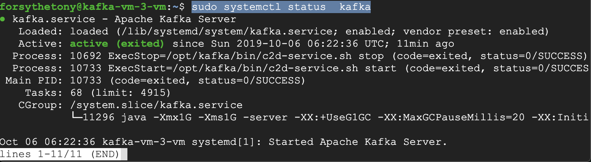

# Setting Up GCP Server for Kafka

This guide will walk you through setting up a GCP VM Instance. It assumes that you already have a project set up. In this guide the project is _Kafka Testing_.

Note: Navigation around GCP is made a _ton_ easier by using the search bar to jump around.

## Creating the VM

1. Navigate to [GCP Instances Dashboard](https://console.cloud.google.com/compute/instances) to view all the instances in your project

2. Click _Create Instance_ -> _Marketplace_
3. Search for "Kafka" by _Google Click to Deploy_ and _Click to Deploy_
4. Give your deployment a name and select a machine type based on your needs (the "1vCPU" was sufficient for testing purposes)
    - Note: You may want to enable Stackdriver logging and moitoring but it isn't necessary.
5. If everything goes well you should see your machine deployed after a few seconds.

6. Navigate to the [_VPC Firewall Rules_](https://console.cloud.google.com/networking/firewalls/list) page. We will need to open up ports 2181 (Zookeeper) and 9092 (Kafka Broker)
7. Select _Create a Firewall Rule_ and fill out with the following information:
    - Name: Whatever you want
    - Direction of Traffic: Ingress
    - Targets: All instances in this network (You should restrict this down to a specified list of Target tags after setup)
    - Target Tags: _Empty_
    - IP Ranges: 0.0.0.0/0 (This is a wildcard to allow access from all IP addresses. This is really only useful in testing. You will want to restrict this range as soon as possible.)
    - Protocols and Ports: Specified Protocols and Ports `9092,2181`
8. Save and you should see your firewall rule appear in the list

9. Navigate back to the [GCP Instances Dashboard](https://console.cloud.google.com/compute/instances) page. Click _SSH_ on your instance to log into your VM.
10. Celebrate 🎉

## Configuring the Server

For outside clients to properly communicate with Kafka you will need to modify the `server.properties` file to make sure that Kafka is advertising a publicly accessible URL to clients and an internal URL for use between broker nodes.

1. SSH into your server
2. Kafka should already be running. You can confirm this by running `sudo systemctl status  kafka`

3. Add the following properties to Kafka's `server.properties` file (`opt/kafka/config/server.properties`). You will have to edit this file as root to make any changes. You can find the values for Internal and External IP address on your [GCP Instances Dashboard](https://console.cloud.google.com/compute/instances)

    ```shell
    sudo vim opt/kafka/config/server.properties
    ```

    ```properties
    listeners=INTERNAL://0.0.0.0:19092,EXTERNAL://0.0.0.0:9092
    listener.security.protocol.map=INTERNAL:PLAINTEXT,EXTERNAL:PLAINTEXT
    advertised.listeners=INTERNAL://<YOUR INTERNAL IP>:19092,EXTERNAL://<YOUR EXTERNAL IP>:9092
    inter.broker.listener.name=INTERNAL
    ```

4. That's it, your server should be ready to accept Kafka connections! 🎉🎉🎉🎉🎉

Note: If you're not using a [static IP address](https://cloud.google.com/compute/docs/ip-addresses/reserve-static-external-ip-address) you might find that your server configuration falls out of date as Google gives you a new IP address from time to time.

## Testing Your Server

1. From your VM run the following:

    ```shell
    kafka-topics.sh --create \
        --zookeeper localhost:2181 \
        --replication-factor 1 \
        --partitions 1 \
        --topic test
    ```

2. From your local machine run `brew install kafkacat`
3. Open two terminal windows and place them side by side
4. In one terminal window run the following to produce messages to your topic:

    ```shell
    kafkacat -b <YOUR EXTERNAL IP>:9092 -t test -P
    ```

5. If the other terminal window run the following to consume messages from your topic:

    ```shell
    kafkacat -b <YOUR EXTERNAL IP>:9092 -t test
    ```

6. You should now be able to type messages into the producer terminal and watch them come through on the consumer window.
7. Celebrate! 🎉🎉🎉🎉🎉
