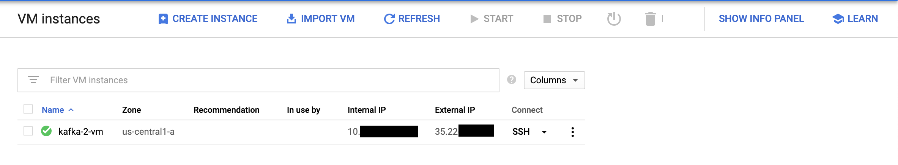
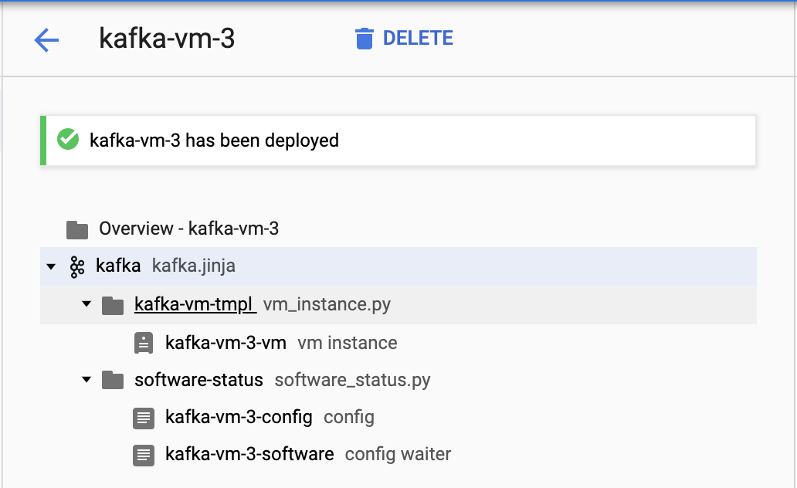
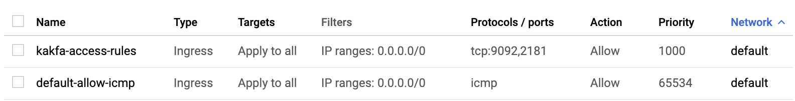

# Setting Up GCP Server for Kafka

This guide will walk you through setting up a GCP VM Instance. It assumes that you already have a project set up. In this guide the project is _Kafka Testing_.

Note: Navigation around GCP is made a _ton_ easier by using the search bar to jump around.

## Steps

1. Navigate to [GCP Instances Instances Dashboard](https://console.cloud.google.com/compute/instances) to view all the instances in your project.

2. Click _Create Instance_ -> _Marketplace_
3. Search for "Kafka" by _Google Click to Deploy_ and _Click to Deploy_
4. Give your deployment a name and select a machine type based on your needs (the "1vCPU" was sufficient for testing purposes)
    - Note: You may want to enable Stackdriver logging and moitoring but it isn't necessary.
5. If everything goes well you should see your machine deployed after a few seconds.

6. Navigate to the [_VPC Firewall Rules_](https://console.cloud.google.com/networking/firewalls/list) page. We will need to open up ports 2181 (Zookeeper) and 9092 (Kafka Broker)
7. Select _Create a Firewall Rule_ and fill out with the following information:
    - Name: Whatever you want
    - Direction of Traffic: Ingress
    - Targets: All instances in this network (You should restrict this down to a specified list of Target tags after setup)
    - Target Tags: _Empty_
    - IP Ranges: 0.0.0.0/0 (This is a wildcard to allow access from all IP addresses. This is really only useful in testing. You will want to restrict this range as soon as possible.)
    - Protocols and Ports: Specified Protocols and Ports `9092,2181`
8. Save and you should see your firewall rule appear in the list

9. Navigate back to the [GCP Instances Instances Dashboard](https://console.cloud.google.com/compute/instances) page. Click _SSH_ on your instance to log into your VM.
10. Celebrate 🎉
